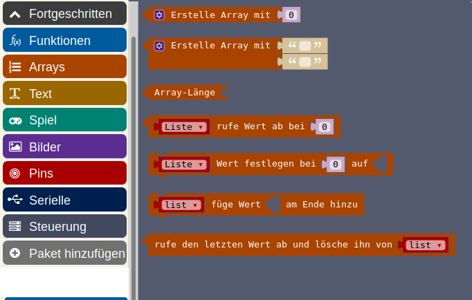
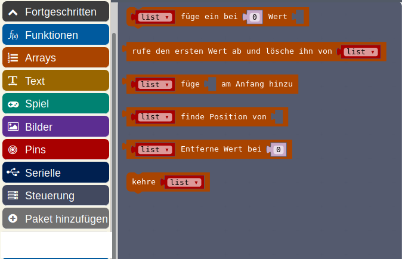
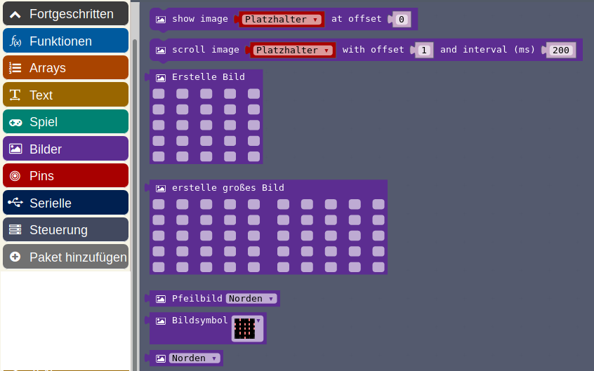
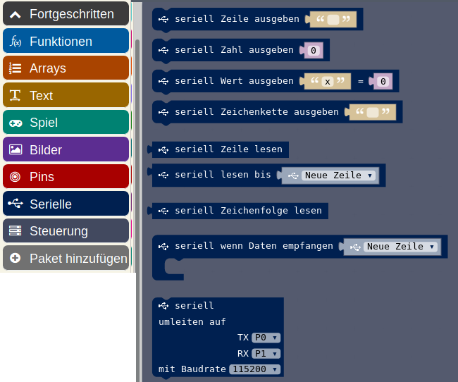

##  01_Standard-Befehle.png

\colA{6cm}

{height=90%}

\colB{6cm}

__Standard-Befehle__

* Werden wir uns alle auf den nächsten Seiten gemeinsam kurz anschauen
* Nur kurzes Ansprechen, damit die Dinge mal gehört wurden
* Ich kenne auch nicht alle Befehle ...
* Hilfe jeweils wenn man mit der Maus darauf bleibt!

\colEnd

##  Fortgeschrittene-Befehle

\colA{6cm}

{height=90%}

\colB{6cm}

__Fortgeschrittene Befehle __

* Auch die schauen wir uns kurz an
* Noch mehr im Schnelldurchlauf
* Fortgeschritten
* Kenne ich selbst zum Teil gar nicht...
* 

\colEnd

##  Grundlagen Standard 

\colA{6cm}

{height=90%}

\colB{6cm}

__Grundlagen Standard__

* Alles zum Loslegen
* Einfache Ausgaben auf LED-"Bildschirm"
* Starten / Dauerhaft 

\colEnd

##  Grundlagen : Mehr 

\colA{6cm}

{height=90%}

\colB{6cm}

__Grundlagen : Mehr__

* nur noch Bildschirm löschen
* und eine Pfeil-Anzige ( 8 Richtungs-Pfeile )

\colEnd

##  Eingabe : Standard

\colA{6cm}

{height=90%}

\colB{6cm}

__Eingabe : Standard __

* Alle Eingabe-Möglichkeiten die der Calliope kennt
* Alle Sensoren
* Knöpfe 
* Die Berührungs-Pins (4 Stück)
* Knopf, Lagesensor, Pins sowohl als
  * Start-Klammer
  * zur Variablen-Zuweisung in Schleifen

\colEnd

##  Eingabe : Mehr

\colA{6cm}

{height=90%}

\colB{6cm}

__Eingabe :  Mehr__

* Zugriff direkt auf die physikalischen Werte
* Zeit-Messung
* Kalibrierungs-Funktion für Kompass (wie beim Handy)
* Selten gebrauchte "Loslassen"-Funktion

\colEnd

##  Musik

\colA{6cm}

{height=90%}

\colB{6cm}

__Musik__

* Einzelne Noten spielen
  * für unterschiedliche Notenlängen
* Pausen
* Ganze Lieder abspielen
* Geschwindigkeit des Abspielens
  * setzen
  * ändern
  * abfragen 

\colEnd

##  LED : Standard 

\colA{6cm}

{height=90%}

\colB{6cm}

__LED: Standard__

* Einzelne LEDs setzen
* und löschen (sehr schlechte Übersetzung)
* invertieren
* LED-Status abfragen 
* Und eine ganze Funktion um Balken zu zeichnen
  * aktueller Wert
  * Maximaler Wert des vollen Balkens

\colEnd

##  LED : Mehr

\colA{6cm}

{height=90%}

\colB{6cm}

__LED : Mehr__

* Helligkeit 
* LED generell an und ausschalten
* Animationen stoppen (Bilder, Lauftexte etc)

\colEnd

##  Schleifen

\colA{6cm}

{height=90%}

\colB{6cm}

__Schleifen__

* Standard-Wiederhol-Schleifen
* Zählschleifen
* Wiederholen solange Wahrheits-Wert
* Abarbeiten einer Liste (siehe weiter bei Array)

\colEnd

##  Logik

\colA{6cm}

{height=90%}

\colB{6cm}

__Logik__

* Wenn-Dann
* Wenn-Dann-Ansonsten usw
* Vergleiche
* Wahrheits-Werte
* Und/Oder-Verknüpfungen 
* Boolsche Algebra

\colEnd

##  Variablen

\colA{6cm}

{height=90%}

\colB{6cm}

__Variablen__

* Variablen anlegen 
* Variablen mit Werten belegen
* Variable abfragen
* Variable um ein Delta verändern 
* __Achtung__: Verwechslungsgefahr!

\colEnd

##  Mathematik : Standard

\colA{6cm}

{height=90%}

\colB{6cm}

__Mathematik : Standard__

* 4 Grundrechenarten
* Achtung: Division ist __ganzzahlig__
  * Rest-Berechnung unter __Mehr__
* Zufalls-Werte 
  * __Achtung__: Zählen ab __0__
  * Oder Wahrheits-Werte per Zufall

\colEnd

##  Mathematik : Mehr

\colA{6cm}

{height=90%}

\colB{6cm}

__Mathematik : Mehr __

* Rest der ganzzahligen Division
* Minima/Maxima - Berechnung
* Absolutwert-Berechnung
* Umwandlung ASCII-Code (Fortgeschritten)

\colEnd

##  Funk : Standard 

\colA{6cm}

{height=90%}

\colB{6cm}

__Funk :  Standard__

* Sende und Empfangs-Richtung
* Sehr einfach zu senden
* Starten auf Empfänger-Seite
* 3 verschiedene Start-Möglichkeiten
* je nachdem welche Sendeart gewählt wurde

\colEnd

##  Funk : Mehr 

\colA{6cm}

{height=90%}

\colB{6cm}

__Funk : Mehr __

* Setzen des Kanals
* Sehr wichtig wenn Sender und Empfänger unterschiedliche Programme verwenden!
* (Wird normalerweise per Zufall bestimmt um nicht alle Calliopes auf dem gleichen Kanal zu haben)
* Wichtig auch wenn Micro:Bit und Calliope sich unterhalten sollen
* Funkstärke
* Debugging (Fehlersuche)

\colEnd

 

##  Motoren 

\colA{6cm}

{height=90%}

\colB{6cm}

__Motoren __

* Calliope kann bis zu zwei Motoren
* Wenn zwei Motoren, dann nur in eine Richtung, mit unterschiedlicher Stärke
* Wenn ein Motor, dann beide Richtungen
* Wenn nur ein Motor, dann bremsen/auslaufen lassen möglich

\colEnd

## Fortgeschrittene-Befehle

\colA{6cm}

{height=90%}

\colB{6cm}

__Fortgeschrittene Befehle __

- Auch die schauen wir uns kurz an
- Noch mehr im Schnelldurchlauf
- Fortgeschritten
- Kenne ich selbst zum Teil gar nicht...
- 

\colEnd

##  Funktionen

\colA{6cm}

{height=90%}

\colB{6cm}

__Funktionen__

* Gleichbleibende Dinge nur einmal "schreiben"
* von verschiedenen Stellen aus aufrufen, z.B.
  * Beim Start
  * Beim Knopfdruck 

\colEnd

 

##  Arrays : Standard 

\colA{6cm}

{height=90%}

\colB{6cm}

__Arrays : Standard__

* Array = Reihe

* Reihe erstellen aus Zahlen oder Zeichenketten

* Reihen manipulieren, abfragen

* Einzelne Reihenwerte ändern

* Reihen verlängern/verkürzen

\colEnd

##  Arrays : Mehr 

\colA{6cm}

{height=90%}

\colB{6cm}

__Arrays : Mehr__

* Fortgeschrittene Manipulation von Arrays

\colEnd

 

##  Text 

\colA{6cm}

{height=90%}

\colB{6cm}

__Text __

* Text-Manipulation
* Text-Länge
* Zeichenketten verketten
* Einzelne Zeichen in Zeichenkette bestimmen
* Teil-Zeichenketten bilden
* Zeichenketten vergleichen
* Zeichenkette in Zahl umwandeln

\colEnd

 

##  Spiel : Standard

\colA{6cm}

{height=90%}

\colB{6cm}

__Spiel : Standard __

Müssen unbedingt angeschaut werden, da die Kinder das als erstes entdecken und sofort ein Spiel "hacken" wollen ...

Sprites = Mini-Grafiken, die eine Bewegungs-Richtung haben

* Bewegung von Sprites
* Kollisionen erkennen
  * andere Sprites
  * Wände
* Spielstand verwalten
* Spielzeit verwalten

\colEnd

##  Spiel : Mehr

\colA{6cm}

{height=90%}

\colB{6cm}

__Spiel : Mehr__

Kontrolle des Spiel-Verlaufs

\colEnd

##  Bilder

\colA{6cm}

{height=90%}

\colB{6cm}

__Bilder__

* Bilder in Variablen halten
* Bilder scrollen
* Pfeile als Variablen 
* Bildsymbole als Variablen

\colEnd

##  Pins : Standard

\colA{6cm}

{height=90%}

\colB{6cm}

__Pins : Standard__

* Verwendung der PINs im Detail
* Analog-Werte lesen und schreiben
* Gemessene Werte auf andere Wertebereiche abbilden
* Ansteuerung von Servo-Motoren
* Spezielle Befehle für Bauteil-Ansteuerung : Computer Protokolle

\colEnd

##  Pins : Mehr

\colA{6cm}

{height=90%}

\colB{6cm}

__Pins : Mehr __

* Sehr detaillierte Festlegung des Verhaltens
* Fortgeschrittene Computer/Elektronik-Funktionen

\colEnd

##  Serielle 

\colA{6cm}

{height=90%}

\colB{6cm}

__Serielle __

* Kommunikation über USB-Kabel mit Computer
* Oft zur Fehlersuche verwendet
* 

\colEnd

##  Steuerung : Standard 

\colA{6cm}

{height=90%}

\colB{6cm}

__Steuerung : Standard__

* Betriebs-System-Funktionen

\colEnd

##  Steuerung : Mehr 

\colA{6cm}

{height=90%}

\colB{6cm}

__Steuerung : Mehr __

* Betriebs-System-Funktionen

\colEnd

 

##  Paket Hinzufuegen

\colA{6cm}

{height=90%}

\colB{6cm}

__Paket Hinzufuegen__

* Programmier"sprache" erweitern 
* Zusätzliche Funktionen
* für zusätzliche, anschliessbare Hardware
* Grove-Sensoren

\colEnd

## Grove Sensoren 

{height=80%}

## Lizenz/Copyright-Info

Für alle Texte und Bilder auf diesen Folien gilt:

- Autor: Jörg Künstner
- Lizenz: CC BY-SA 4.0

