# Weiterführende Infos Calliope

## Übersicht

* Websites
* Social Media
* Bücher
* Videos
* Andere Websites, Nicht Calliope 
* Organisationen, "Hackatons", Codedojo, etc

__Speziell für Lehrer__

* MOOC für Lehrer (Massive open online course)
* Lehr / Lern-Material frei
* Lehr / Lern-Material kommerziell
* Anregungen für Einbindung in Unterricht

## Webseiten (1)

{height=80%}

## Webseiten (2)

{height=80%}

## Webseiten (3)

{height=80%}

## Webseiten (4)

{height=80%}

## Webseiten (5)

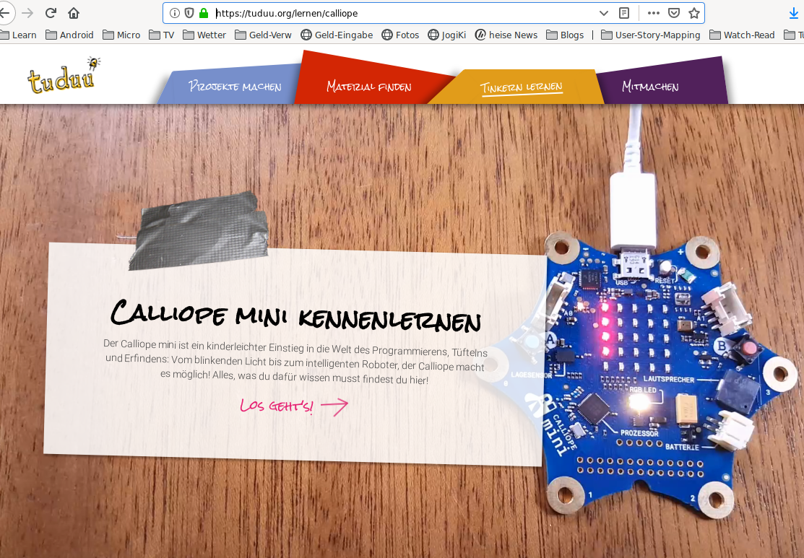{height=80%}

## Webseiten (6)

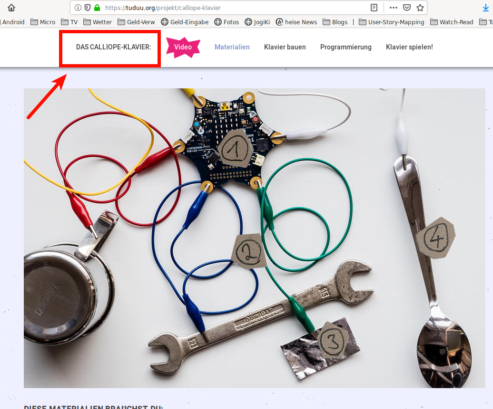{height=80%}

## Webseiten (7)

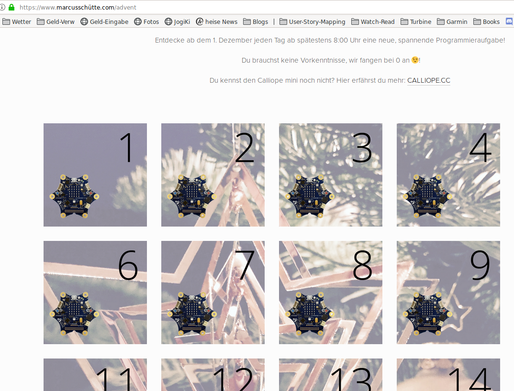{height=80%}

## Webseiten (8)

{height=80%}

## Webseiten (9)

Programmierung Calliope in Python

{height=70%}

<http://www.tigerjython4kids.ch> 

## Webseiten (10) Zusammenfassung

* Die Webpage von calliope selbst : <https://calliope.cc>

  * Viele dort verlinkte Seiten
  * Website von Hackster.io , <https://www.hackster.io/calliope-mini>
* Die Web-Page von Calliope Saarland: <https://www.calliope-saarland.de>
* Die Calliope-Seite von tuduu: <https://tuduu.org/lernen/calliope>
* Der Calliope Advents-Kalender : <https://www.marcusschütte.com/advent>
* Die Webpage von diesem Kurs : <http://www.calliope-jogi.org>
* Programmierung des Calliope auch mit Python:  <http://www.tigerjython4kids.ch>

## Social Media

- Offizieller Twitter-Kanal von Calliope : <https://twitter.com/CalliopeMini>
- Twitter-Kanal von Calliope Saarland : <https://twitter.com/calliope_saar>
- Offizielle Twitter-Kanal von Hackster.io : <https://twitter.com/Hacksterio>

{height=50%}

## Bücher (1)

\colA{6cm}

{height=80%}

\colB{6cm}

__Für Dummies: Programmieren mit dem Calliope mini __

* Guter Einstieg 
* Inhaltlich mittlere Qualität
* Die wichtigsten Themen abgedeckt
* billig: 9.99 €

\colEnd

## Bücher (2)

\colA{6cm}

{height=80%}

\colB{6cm}

__Franzis Verlag : Programmieren lernen mit dem Calliope mini __

- Sehr guter Einstieg
- Meines Erachtens einiges bessere Qualität als das Dummies-Buch
- Die wichtigsten Themen werden abgedeckt
- Neu-Auflage 2019 (noch nicht angesehen)
- Als gedrucktes Buch : 25 € 

\colEnd

## Bücher (3)

\colA{6cm}

{height=80%}

\colB{6cm}

__Vierfarben : Calliope mini, Coden, basteln, entdecken__

* Aus meiner Sicht : Das Beste der Bücher
* langsamer Einstieg 
* Grundlagen 
* Sehr weit umfassend
* Gedruckte Ausgabe : 19.90 €

\colEnd

## Bücher (4)

\colA{6cm}

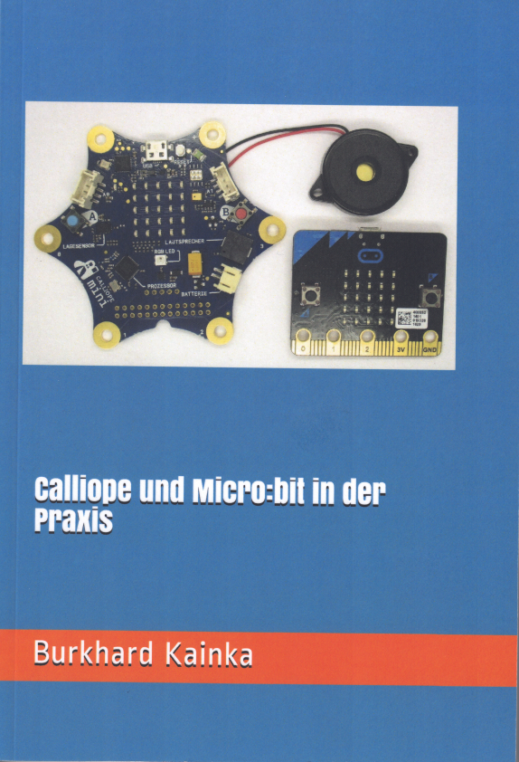{height=80%}

\colB{6cm}

__Burkhard Kainka: Calliope und Micro:Bit in der Praxis__

* Fortgeschrittenen-Buch
* Sehr tiefgehende Themen
* Definitiv nichts für Anfänger
* "echte" Elektronik-Kenntnisse benötigt 
* Programmierung mit mbed-Oberfläche in c++
* Gedrucktes Exemplar : 14.95 €

\colEnd

## Bücher (5)

\colA{6cm}

{height=80%}

\colB{6cm}

__DK-Verlag: Programmieren supereasy, Scratch und Python__

* Stellvertretend für andere Konzepte
* Ein SEHR gutes Buch zum Einstieg
* Zuerst Scratch, grafisches Programmieren
* Zweiter Teil, mit einer richtigen Sprache: Python
* Gebundenes Buch : 16.95 €

\colEnd

## Bücher frei/online (1)

\colA{6cm}

{height=80%}

\colB{6cm}

__dpunkt-Verlag : Das Calliope-Buch __

* Das erste Calliope Buch überhaupt
* Das offizielle Buch von calliope selbst
* Mehrere Autoren, mehrere Projekte
* Unterschiedlicher Schreibstil
* Frei verfügbar online : <http://www.dpunkt.de/calliope>
* Als gedrucktes Buch : 22.90 € 

\colEnd

## Bücher frei/online (2)

\colA{6cm}

{height=80%}

\colB{6cm}

__Cornelsen-Verlag : Coden mit dem Calliope mini__

* 3 Bücher als PDF online verfügbar
  * 2 * Schülermaterial
  * 1 * Lehrermaterial
* Online herunterladen hier: <https://www.calliope.cc/schulen/schulmaterial>
* Zum Kaufen hier:  <https://www.cornelsen.de/calliope>
* Gedruckte Version : je 6.50 € bzw 12.99 € für Lehrer-Material

\colEnd

## Videos (1)

Einführungs-Video von Kindern für Kinder  

Miss Hennipenny : <https://www.youtube.com/channel/UCqA6HPlNNGNMJK9GXzp5WoA>

{height=60%}

## Videos (2)

{height=70%}

## Videos (3)

Kurzes Einführungs-Video auf dem KIKA-Kanal:

Video auf Kika : <https://www.kika.de/timster/videos/video45586.html>

## Videos (4)

Youtube-Kanal eines "Creative Coders"

Sehr viele meist kurze Videos zum Calliope

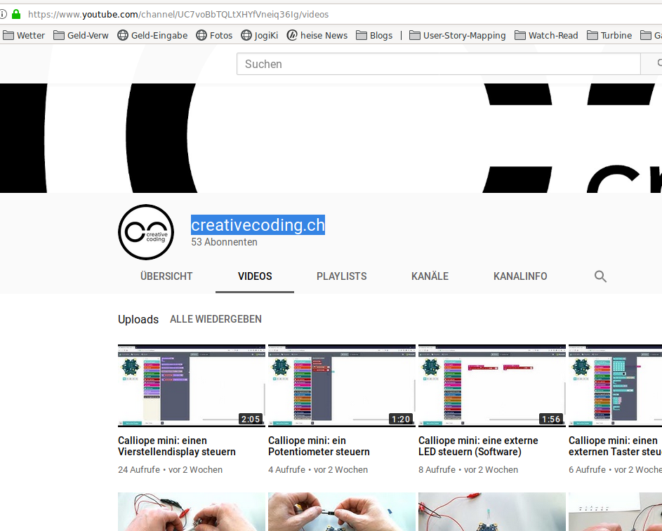{height=70%}

## Videos (5)

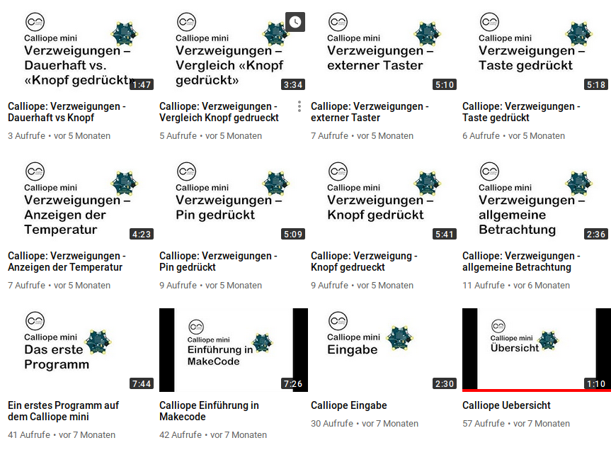{height=70%}

<https://www.youtube.com/channel/UC7voBbTQLtXHYfVneiq36Ig/videos>

## Videos (6)

{height=70%}

Wie rechnet ein Computer? Sendung mit der Maus mit Lampen  <https://www.youtube.com/watch?v=9l-l_dD6qPQ>

## Videos (7) Zusammenfassung

Miss Hennipenny : <https://www.youtube.com/channel/UCqA6HPlNNGNMJK9GXzp5WoA>

Video auf Kika : <https://www.kika.de/timster/videos/video45586.html>

Youtube: Creative Coder <https://www.youtube.com/channel/UC7voBbTQLtXHYfVneiq36Ig/videos>

Sendung mit der Maus:   <https://www.youtube.com/watch?v=9l-l_dD6qPQ>

## Andere Websites, nicht Calliope (1)

{height=70%}

Code.org : <http://code.org/>

## Andere Websites, nicht Calliope (2)

{height=70%}

Dort ganz konkret zum Programmieren Lernen/Starten

Hour of Code : <https://hourofcode.com/de/learn>  

## Weiterführend "Offline" / Hackatons 

__Jugend Hackt, speziell in der Schweiz__:  

<https://jugendhackt.org/anmeldung-fuer-jugend-hackt-schweiz/>

__CoderDojo Luzern : letzter Sonntag im Monat__ (wenn Zeit: Mentor):  

<https://coderdojoluzern.ch/>

__CoderDojo Zürich (jeden Sonntag) :__ 

<https://www.meetup.com/de-DE/Coder-Dojo-Zurich/>

__Elektronik, Arduino, Calliope-Meetup Turbine, alle 2-3 Wochen:__

<https://www.meetup.com/de-DE/Arduino-Raspberry-Pi-und-mehr-Innerschwyz/>

# Infos speziell für Lehrer

## MOOC für Lehrer (1)

**MOOC = Massive Open Online Courses**

{height=80%}

## MOOC für Lehrer (2)

iMoox auf Heise gesehen:

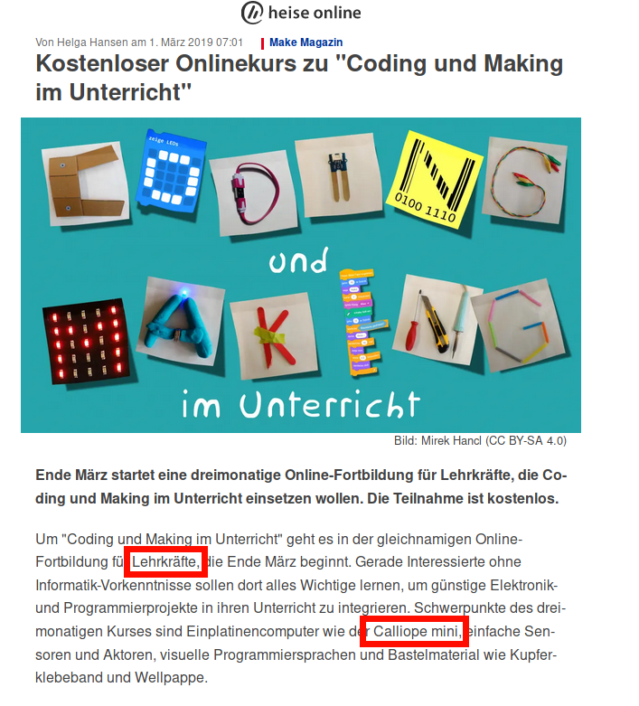{height=70%}

## MOOC für Lehrer (3)

Angemeldet, Kurs hat am Montag 25.03. begonnen.  
Leider noch keine Zeit reinzuschauen...

{height=70%}

## MOOC für Lehrer (4)

__Zusammenfassung:__

openSAP :

<https://open.sap.com/courses/calli1>

iMoox : 

<https://imoox.at/mooc/>

## Lehr-Bücher

Siehe oben, bei der ganzen Bücher-Zusammenstellung, Cornelsen-Verlag

## Lehr/Lernmaterial frei (1)

Angebot von __AppCamps__ : <http://www.appcamps.de>

{height=70%}

## Lehr/Lernmaterial frei (2)

{height=70%}

## Lehr/Lernmaterial frei (3)

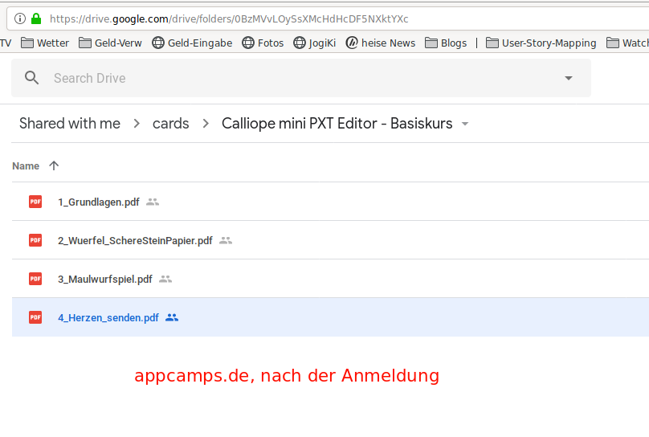{height=70%}

## Lehr/Lernmaterial frei (4)

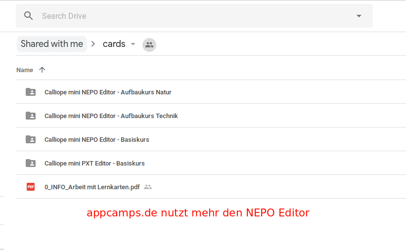{height=70%}

## Lehr/Lernmaterial frei (5)

Open Education Ressources OER bei Tüftel-Akademie : <https://tueftelakademie.de/oer-materialien/>

{height=70%}

## Lehr/Lernmaterial frei (6)

{height=70%}

<https://www.roberta-home.de/lehrkraefte/lerneinheitenexperimente>

## Lehr/Lernmaterial frei (7)

PHZH :   <https://phzh.ch/mia#calliope>

{height=70%}

## Lehr/Lernmaterial frei (8)

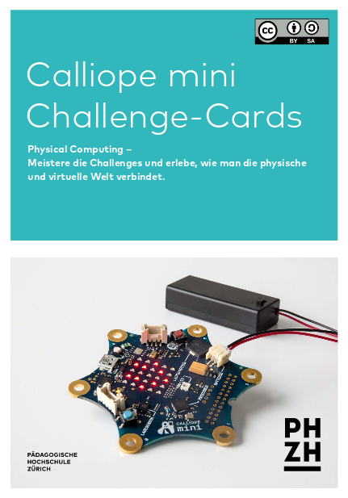{height=70%}

<https://phzh.ch/globalassets/phzh.ch/medienbildung/dokumente/kurs-highlights_calliope-karten.pdf>

## Lehr/Lernmaterial frei (9)

__Lehrmittel UNI Bremen__

- <http://elib.suub.uni-bremen.de/edocs/00107011-1.pdf>
- <http://elib.suub.uni-bremen.de/edocs/00107011-1.pdf>
- <http://elib.suub.uni-bremen.de/edocs/00107010-1.pdf>
- <http://elib.suub.uni-bremen.de/edocs/00107009-1.pdf>
- <http://elib.suub.uni-bremen.de/edocs/00107008-1.pdf>
- <http://elib.suub.uni-bremen.de/edocs/00107006-1.pdf>
- <http://elib.suub.uni-bremen.de/edocs/00107005-1.pdf>   

## Lehr/Lernmaterial frei (9)

__Lehrmittel LPM Saarland__

## Lehr/Lernmaterial frei (10)

__Coding im MINT-Unterricht__

{height=70%}

<https://www.science-on-stage.de/page/display/de/7/7/1442/coding-im-mint-unterricht>

## Lehr/Lernmaterial frei (11)

* Angebot von __AppCamps__ : <http://www.appcamps.de>

- Open Education Ressources OER bei Tüftel-Akademie : <https://tueftelakademie.de/oer-materialien/>
- Open Roberta : <https://www.roberta-home.de/lehrkraefte/lerneinheitenexperimente>

- PHZH :  <https://phzh.ch/mia#calliope>
  - <https://phzh.ch/globalassets/phzh.ch/medienbildung/dokumente/kurs-highlights_calliope-karten.pdf>

- Coding im Mint-Unterricht: <https://www.science-on-stage.de/page/display/de/7/7/1442/coding-im-mint-unterricht>

## Lehr/Lernmaterial kommerziell (1)

Angebot von fobizz.com : (kommerziell) <https://fobizz.com/fortbildung-calliope-mini-im-unterricht/>

{height=70%}

## Lehr/Lernmaterial kommerziell (2)

Tüftel-Akademie :  <https://tueftelakademie.de/courses/calliope-mini-einfuehrung/>

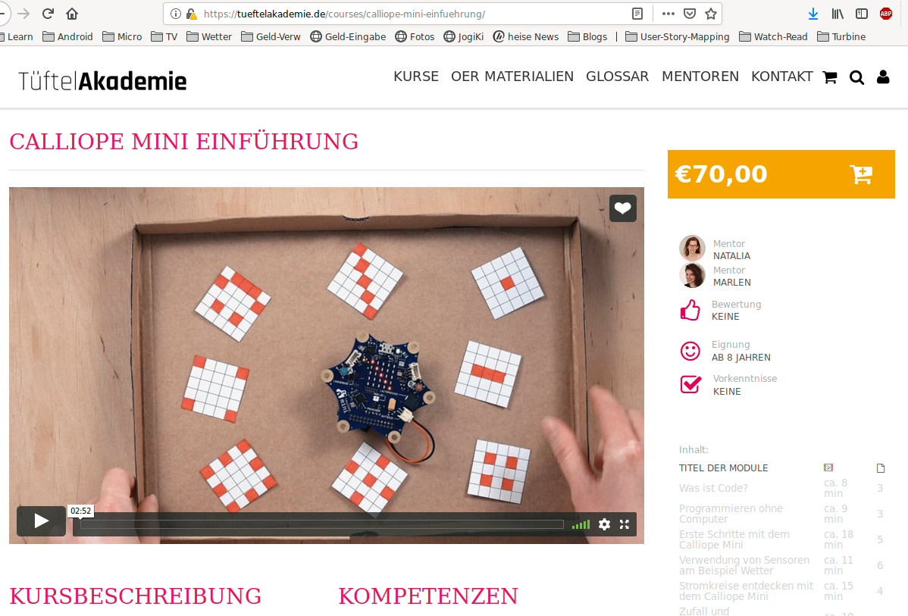{height=70%}

## Erfahrungen von Schulen etc

Vortrag auf dem Chaos Communication Congress: __Digitale Bildung in der Schule__ (Video):    

<https://media.ccc.de/v/34c3-8865-digitale_bildung_in_der_schule#t=1669>

Studie der Universität Bremen über Einsatz des Calliope im Unterricht (Artikel)  

Artikel: <https://www.uni-bremen.de/tzi/data/nachrichten/news/detail/News/mini-computer-bew%C3%A4hrt-sich-in-der-grundschule-1/>

Studie selbst:  <http://nbn-resolving.de/urn:nbn:de:gbv:46-00106848-17>

## Ideen für den Unterricht (1)

Kunst: 

- Farbmischung, z.B. <https://makecode.com/_WYTL5t3swhFq>

Musik :

- Musik-Möglichkeiten, Noten
- Metronom
- Klavier : <https://tuduu.org/projekt/calliope-klavier>

## Ideen für den Unterricht (2)

Mathematik:

- Mathelerner, 1*1 per Zufall
- Zufall, Wahrscheinlichkeitsverteilung
- Rechner, Zähler

Sport:

- Schrittzähler
- Stoppuhr
- Fangen-Spiel (Treffer reduziert Leben)

## Angebot Herrengasse-Lehrer

Zuschauer/Zuhörer beim neuen Kurs für Kinder

* ab 10.April
* jeweils 16-18 Uhr
* Bitte eigenen Laptop mitbringen, wenn möglich
* hinterer Tisch
* Lehrer : Calliope
* Jogi : Didaktik, Pädagogik
* Win-Win ...

## Lizenz/Copyright-Info

Für alle Texte und Bilder auf diesen Folien gilt:

* Autor: Jörg Künstner
* Lizenz: CC BY-SA 4.0

