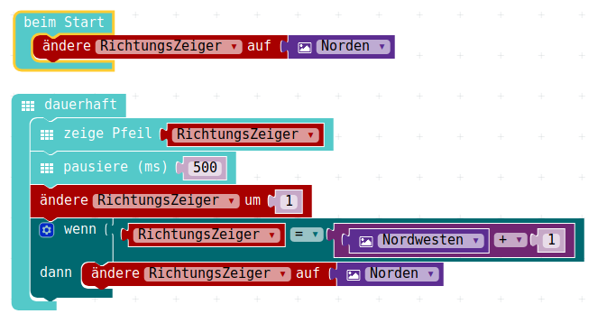
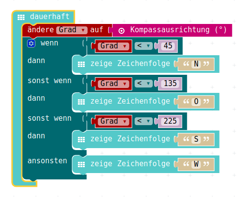
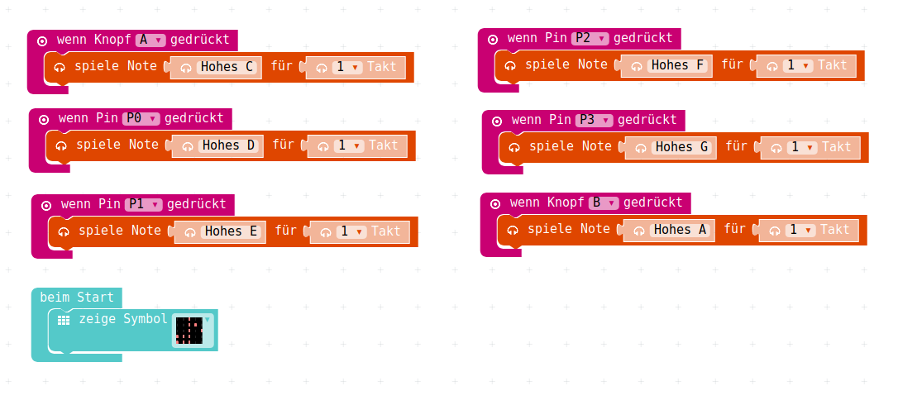

# Einige Beispiele

## Einmal-Eins-Generator

{height=80%}

## Richtungs-Zeiger Rad

{height=80%}

## Kompass-Sensor

{height=80%}

## Schubladen-Alarm mit Lichtsensor

{height=80%}

## Mini-Klavier mit Tasten/Pins

{height=80%}

## Farbrad am RGB-Led mit Tasten/Pins

{height=80%}

## Zeitmessung => Reaktionsmesser

{height=80%}

## Lizenz/Copyright-Info

Für alle Texte und Bilder auf diesen Folien gilt:

* Autor: Jörg Künstner
* Lizenz: CC BY-SA 4.0

