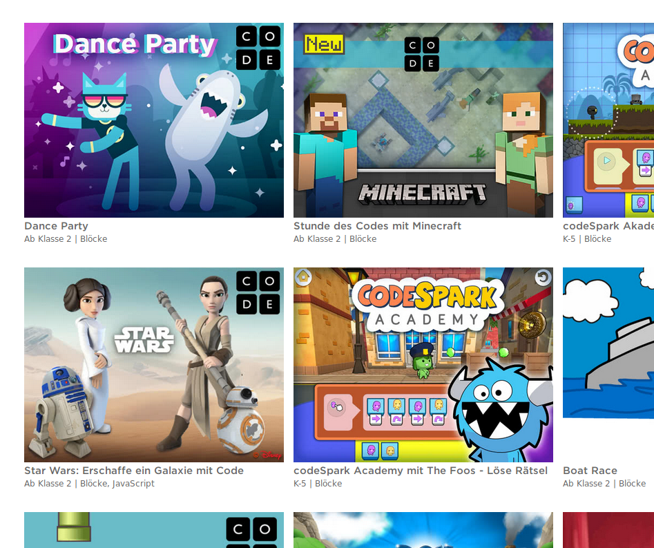
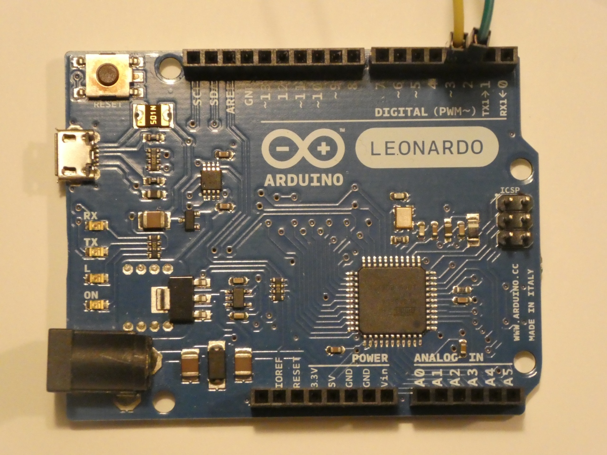
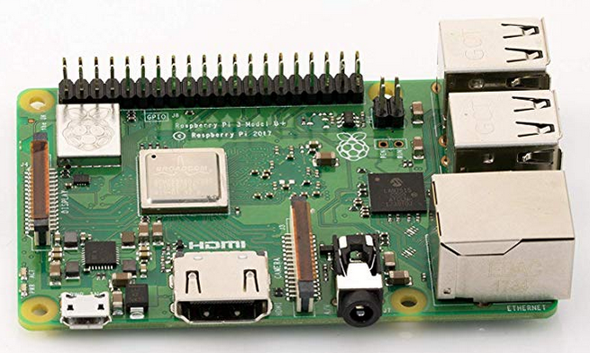
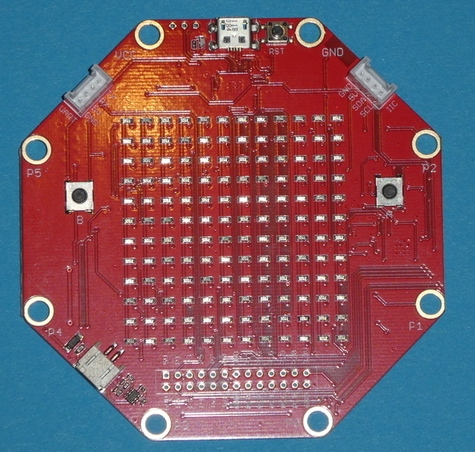

# Warum Calliope

## Zielgruppe

Vor Auswahl eines Konzepts:

* welche Zielgruppe ?
* welche generellen Ziele? 

unter folgenden Gesichtspunkten sind die folgenden Seiten zu sehen:

* Nicht nur am Handy / Computer konsumieren sondern auch 

* Selbst gestalten
* "Computer"-Sprache kennenleren
* Interesse für Computer und Basteln wecken
* Interesse für Programmieren wecken
* Ab ca 9 Jahre
* Wenn möglich in der Schule nutzbar, in den Unterricht intergrierbar 

## Grundüberlegungen

* Umsetzung rein in __Software__
* Möglichst ohne Installation 
* Auf verschiedenen Betriebsystemen nutzbar
* vermutlich Browser-Basiert

oder

* Umsetzung mit Software __und Hardware__
* Zusätzlicher Hardware-Bedarf
* Noch höhere Anforderungen an Material und Budget
* Dafür mehr Integration in die reale Welt möglich 
* Kinder/Schüler können das evt mit nach Hause nehmen
* Je nach Konzept : Einstieg in Robotik 

## Software-Konzepte

* Scratch

* Hour of Code

* Blocky <https://developers.google.com/blockly/>

* uvm, siehe z.B.:
  <https://www.codingkids.de/machen/programmieren-fuer-kinder-11-tolle-ideen>

   

## Scratch

\colA{6cm}

{height=80%}

\colB{6cm}

<https://scratch.mit.edu/>

* Block-Basiert
* Sehr einfach zu lernen
* Doch sehr mächtig
* Browser-Basiert, seit Version 3 auch auf iPad nutzbar
* viele Anleitungen und Hilfen
* meines Erachtens __DIE__ bekannteste Block-Programmiersprache

\colEnd

## Hour of Code/code.org

\colA{6cm}

{height=80%}

\colB{6cm}

<https://hourofcode.com/de/learn>

* Verschiedene "Missionen"
* Fast komplett selbständig durchführbar
* Unterschiedliche Interessengebiete
  * Minecraft !
  * Star-Wars !
  * Flappy - Birds -Spiele  
* komplett browser-basiert
* Sehr toller Startpunkt für "Nur-SW"

\colEnd

## Konzepte mit Hardware

* Arduino
* Raspberry Pi
* BBC Micro:Bit
* Calliope
* Sino:Bit
* Kniwwelino
* Oxo-Card
* EduArdu
* mBot (und andere Robotik-Plattformen)

## Arduino

\colA{6cm}

{height=40%}

{height=40%}

\colB{6cm}

* Der __Urvater__ von __massentauglichen__ Microcontroller-Platinen
* Extrem viel zusätzliche Hardware
* Sehr billig (Clone ab ca 8 CHF)
* Super Einstieg in die Welt der Elektronik und des Programmierens
* Programmierung mit textueller Programmiersprache
* Einfaches Entwicklungs-Umgebung, braucht Installation 
* ab ca 12 Jahren
* ohne Zusatz-Hardware "nutzlos"

\colEnd

## Raspberry Pi

\colA{6cm}

{height=80%}

\colB{6cm}

* Ein kompletter __Linux__-Rechner
* __massentauglicher__ Einplatinen-Rechner
*  Extrem viel zusätzliche Hardware, Software verfügbar
* Sehr billig ( Zero ab ca 8 CHf , Raspi 3 B+ ca 40 CHf)
* Viele verschiedene Programmiersprachen
* braucht Installation 
* ab ca 13 Jahren
* ohne Zusatz-Hardware und Monitor/Tastatur "nutzlos"

\colEnd

## BBC Micro:Bit

\colA{6cm}

Hier fehlt noch ein Bild von einem Zusatz-Board

\colB{6cm}

* 2015 von der BBC vorgestellt um Schulen damit auszurüsten
* Zielgruppe: Schüler ab 11-12
* Sehr viel Informationen , grosses "Öko-System" 
* "Vater" des Calliope, sehr ähnliche Hardware
* Programme zum Teil direkt austauschbar
* Viele Hardware-Addons verfügbar
* passt sehr gut in den Lehr-Betrieb
* Billig, ca 20 CHF 
\colEnd

## Calliope (1)

\colA{6cm}

{height=80%}

\colB{6cm}

* 2017 auf Basis des BBC Micro:Bit in Deutschland entwickelt
* Ziel: schon ab der dritten Klasse in die Schule
* Änderungen
    * Sternform => weniger Kurzschluss-Gefahr
    * Microfon und Lautsprecher
    * Motor-Treiber um Motoren anzuschliessen
    * RGB-Led
    * Groove - Konnektoren
    
\colEnd

## Calliope (2)

* 2018 erste Schulen in Deutschland ausgerüstet
* Inzwischen deutschsprachiges Lehr-Material verfügbar
* Erweiterbarkeit nicht mit Steckplatinen möglich
* Kleinere Community verglichen mit BBC Micro:Bit
* Software-Features "hinken" hinterher
* Dafür: Alles in Deutsch, darum schon früh verwendbar in deutsch-sprachigen Schulen
* Teurer als BBC Micro-Bit ( 45-50 CHF)
    
Hier evt. noch ein Bild von Groove-Konnektoren rein.    
    
\colEnd

## Sino:Bit

\colA{6cm}

{height=80%}

\colB{6cm}

\colEnd

## Kniwwelino

\colA{6cm}

{height=60%}

\colB{6cm}

\colEnd

## OxoCard

\colA{6cm}

{height=40%}

{height=40%}

\colB{6cm}

\colEnd

## EduArdu

\colA{6cm}

{height=70%}

\colB{6cm}

\colEnd

## mBot

\colA{6cm}

\colB{6cm}

\colEnd

## Fazit

