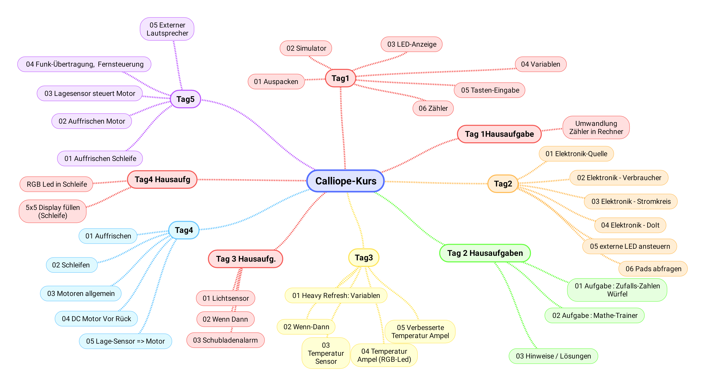

# Calliope-Programme zum Programmieren Lernen

Dies ist die Sammlung für den Kurs in der Turbine :  
__Basteln, Programmieren Lernen und Elektronik Grundlagen mit Calliope-Mini__  
__Ausgabe für den Kurs ab Oktober 2020__  
__Herbst 2020__  

<!--
## Download Gesamtkurs als Folien
 
[Kurs CalliopeMini-ProgrammierenLernen als PDF-Folien](CalliopeMini-ProgrammierenLernen.pdf)
-->

## Lektionen / Nachmittage

### [Lektion / Nachmittag  1](01_Tag1/index.html)

* [01: Auspacken, Einschalten](01_Tag1/01_01_Auspacken-Einschalten/index.html)
* [02: Start Simulator](01_Tag1/01_02_Start_Simulator/index.html)
* [03: LED Anzeigen](01_Tag1/01_03_LED_Anzeigen/index.html)
* [04: Programm auf Calliope laden](01_Tag1/01_04_Programm_Auf_Calliope_Laden/index.html)
* [05: Texte anzeigen](01_Tag1/01_05_Texte_Anzeigen/index.html)
* [06: Zahlen anzeigen](01_Tag1/01_06_Zahlen_Anzeigen/index.html)
* [07: Platzhalter/Variablen](01_Tag1/01_07_Platzhalter/index.html)
* [08: BeimStart](01_Tag1/01_08_BeimStart/index.html)
* [09: Tasten-Eingabe](01_Tag1/01_09_TastenEingabe/index.html)
* [10: Taschenrechner](01_Tag1/01_10_Taschenrechner/index.html)
* [11: Gespeicherte HexFiles laden](01_Tag1/01_11_HexFiles_Simulator/index.html)

<!--

### [Lektion / Nachmittag  2](02_Tag2/index.html)

* [01: Auffrischen](02_Tag2/02_01_Auffrischen/index.html)
* [02: Auffrischen Do-It](02_Tag2/02_02_Auffrischen_DoIt/index.html)
* [03: Elektronik Spannungsquellen](02_Tag2/02_03_Elektronik_Spannungsquelle/index.html)
* [04: Elektronik Verbraucher](02_Tag2/02_04_Elektronik_Verbraucher/index.html)
* [05: Elektronik Stromkreis](02_Tag2/02_05_Elektronik_Stromkreis/index.html)
* [06: Elektronik Action](02_Tag2/02_06_Elektronik_Action/index.html)
* [07: Externe LEDs](02_Tag2/02_07_ExterneLED/index.html)
* [08: PINs](02_Tag2/02_08_PINs/index.html)

### [Ferien-Hausaufgabe: Mathetrainer](03_Tag2_Nachlese)

* [01: Zufallszahlen Würfel](03_Tag2_Nachlese/03_01_Zufall/index.html)
* [02: Die Aufgabe:Mathetrainer](03_Tag2_Nachlese/03_02_Die_Aufgabe/index.html)
* [03: Hinweise Teil 1](03_Tag2_Nachlese/03_03_Teil1_Hinweise/index.html)
* [04: Lösung Teil1](03_Tag2_Nachlese/03_04_Teil1_Loesung/index.html)
* [05: Hinweise Teil 2](03_Tag2_Nachlese/03_05_Teil2_Hinweise/index.html)
* [06: Lösung Teil2](03_Tag2_Nachlese/03_06_Teil2_Loesung/index.html)

### [Lektion / Nachmittag  3](04_Tag3)

* [01: Auffrischen Variablen](04_Tag3/04_01_Auffrischen_Variablen/index.html)
* [02: Auffrischen Ampel](04_Tag3/04_02_Auffrischen_Ampel/index.html)
* [03: Wenn - Dann - Ansonsten](04_Tag3/04_03_Wenn-Dann/index.html)
* [04: Temperatur-Sensor](04_Tag3/04_04_TemperaturSensor/index.html)
* [05: RGB-Leuchtdiode / Temperatur-Ampel](04_Tag3/04_05_TemperaturAmpel/index.html)
* [06: verbesserte Temperatur-Ampel/Fehlersuche](04_Tag3/04_06_TemperaturAmpelBesser/index.html)

### ["Hausaufgabe": Schubladen-Alarmanlage](05_Tag3_Nachlese)

* [Der Lichtsensor](05_Tag3_Nachlese/05_01_LichtSensor/index.html)
* [Der SchubladenAlarm](05_Tag3_Nachlese/05_02_SchubladenAlarm/index.html)

### [Lektion / Nachmittag  4](06_Tag4)

* [01 Auffrischen: Logik und Wenn-Dann](06_Tag4/06_01_Auffrischen/index.html)
* [02 Schleifen-Programmierung  ](06_Tag4/06_02_Schleifen/index.html)
* [03 Motoren Übersicht](06_Tag4/06_03_Motoren/index.html)
* [04 Ansteuerung von DC-Motoren](06_Tag4/06_04_DC_Motoren/index.html)
* [05 Lagesensor](06_Tag4/06_05_LageSensor/index.html)

### ["Hausaufgabe": Schleifen ](07_Tag4_Nachlese)

* [Ein paar Schleifen-Anwendungen](07_Tag4_Nachlese/index.html)

### [Lektion / Nachmittag  5](08_Tag5)

* [01 Auffrischen: Schleifen ](08_Tag5/08_01_Auffrischen/index.html)
* [02 Auffrischen Motor](08_Tag5/08_02_Motoren_Auffrischen/index.html)
* [03 Der Lagesensor ](08_Tag5/08_03_LageSensor/index.html)
* [04 Funkübertragung](08_Tag5/08_04_Funkuebertragung/index.html)
* [05 Externer Lautsprecher](08_Tag5/08_05_ExternerLautsprecher/index.html)

-->

### Gesamt-Übersicht

<!--

### [Linksammlung](LinkSammlung)

### [Unsortierte Ideen](Sammlung)
-->

