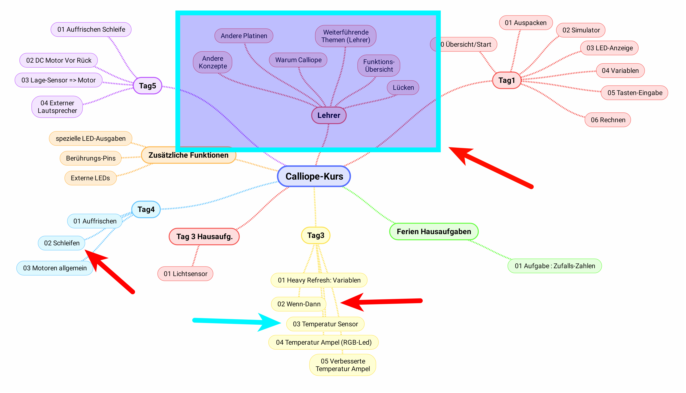

# Calliope-Programme zum Programmieren Lernen
    

Dies ist das Skript / die Anleitung / der Komplett-Mitschrieb für den Kurs in der Turbine :  
__Basteln, Programmieren Lernen und Elektronik Grundlagen mit Calliope-Mini__  
__Ausgabe für die Lehrer der Herrengasse Schwyz__  
__Frühjahr 2019__  

    

## Lektionen / Nachmittage

### [Lektion / Nachmittag  1](01_Tag1/index.html)

* [00: Programmieren Start](01_Tag1/01_00_Programmieren/index.html)
* [01: Auspacken, Einschalten](01_Tag1/01_01_Auspacken-Einschalten/index.html)
* [02: Start Simulator](01_Tag1/01_02_Start_Simulator/index.html)
* [03: LED Anzeigen](01_Tag1/01_03_LED_Anzeigen/index.html)
* [04: Programm auf Calliope laden](01_Tag1/01_04_Programm_Auf_Calliope_Laden/index.html)
* [05: Texte anzeigen](01_Tag1/01_05_Texte_Anzeigen/index.html)
* [06: Zahlen anzeigen](01_Tag1/01_06_Zahlen_Anzeigen/index.html)
* [07: Platzhalter/Variablen](01_Tag1/01_07_Platzhalter/index.html)
* [08: BeimStart](01_Tag1/01_08_BeimStart/index.html)
* [09: Tasten-Eingabe](01_Tag1/01_09_TastenEingabe/index.html)
* [10: Zaehler](01_Tag1/01_10_Zaehler/index.html)
* [11: Gespeicherte HexFiles laden](01_Tag1/01_11_HexFiles_Simulator/index.html)

### [Lektion / Nachmittag  2](09_Lehrer/index.html)

* [01: Wenn-Dann Abfragen](09_Lehrer/09_01_Wenn-Dann/index.html)
* [02: Der Temperatur-Sensor](09_Lehrer/09_02_TemperaturSensor/index.html)
* [03: Temperatur-Ampel](09_Lehrer/09_03_TemperaturAmpel/index.html)
* [04: Bessere Temperatur-Ampel](09_Lehrer/09_04_TemperaturAmpelBesser/index.html)
* [05: Schleifen ](09_Lehrer/09_05_Schleifen/index.html)
* [06: Warum Calliope, Alternativen](09_Lehrer/09_06_Warum_Calliope/index.html)
* [07: Weitere Infos für Lehrer](09_Lehrer/09_07_Infos_Lehrer/index.html)
* [08: Einige Beispiele](09_Lehrer/09_08_Beispiele/index.html)
* [09: Übersicht Calliope Befehle](09_Lehrer/09_09_Calliope_Befehle/index.html)
    

