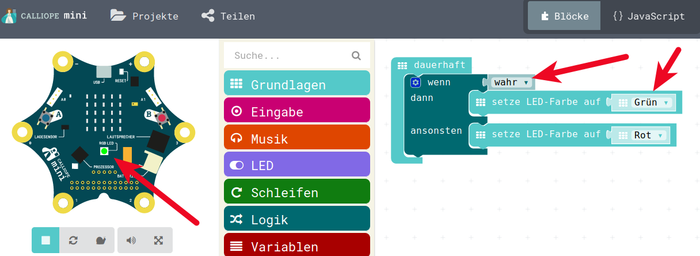
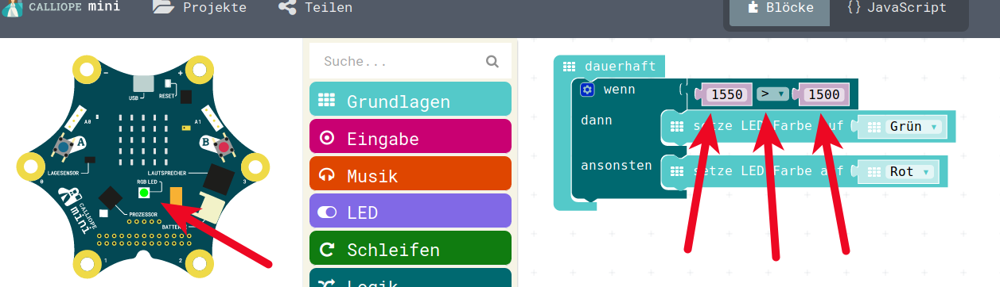
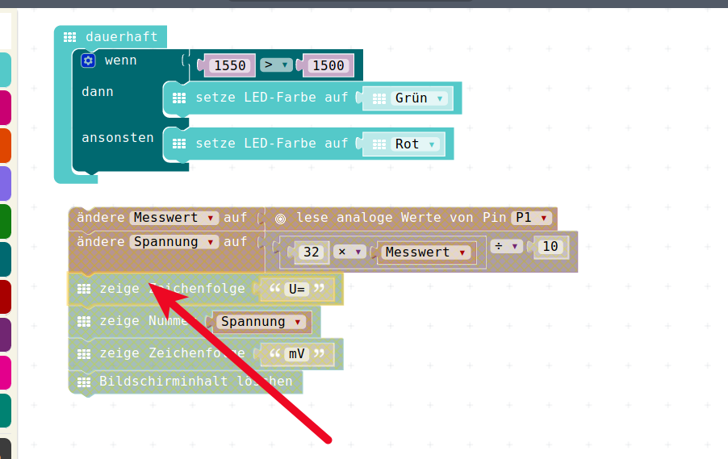
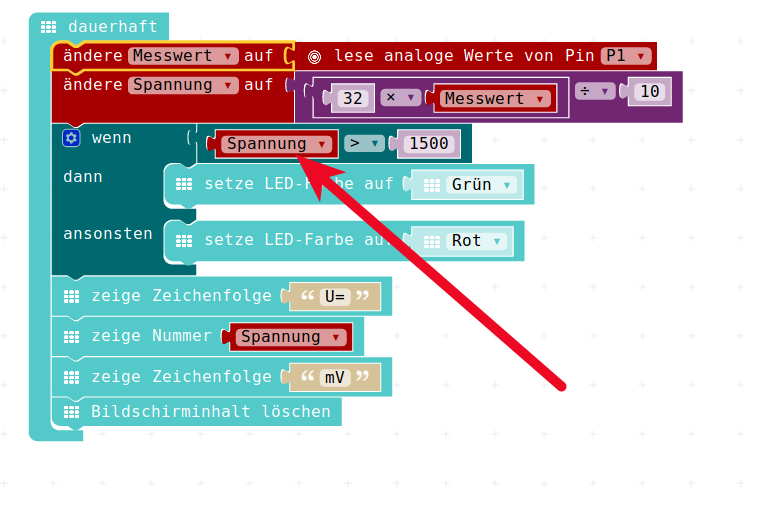

# Logik, Vergleiche, Wahrheit


## Weltmeisterschaft / Fussball-Wetten / Vergleiche


Wer hat die Fussball-Weltmeisterschaft geschaut?   
Wer hat dabei Wetten gemacht" ?  
**Wenn** die Schweiz ein Tor mehr schiesst als Deutschland, **dann** bekomme ich von Dir zwei zusätzliche Panini-Bilder?  

Wer streitet hin und wieder mit seinem Freund?  
**Wenn** Du mir das Lego nicht gibst, **dann** bekommst Du von mir keine Schokolade mehr.   

und so weiter...

Das alles sind Vergleiche, die normalerweise dann im Anschluss überprüft werden können und sich entweder als wahr oder falsch erweisen.

Je nachdem, ob wahr oder falsch, wird dann etwas gemacht:

* Du bist nicht mehr mein Freund
* Du musst mir zwei Panini geben
* Ich muss Dir eine Schoki geben
* ...

Das ist eines der wichtigen Eigenschaften auch beim Programmieren:

* Einen **Vergleich** machen, der ein Ergebnis hat, dies ist im Allgemeinen **wahr** oder **falsch**
* Basierend auf dem wahr oder falsch wird dann etwas unterschiedliches __gemacht__, es wird eine __Aktion__ ausgelöst.

Das wollen wir jetzt auch machen

## Freiräumen der Dauerhaft-Schleife

Herausziehen des bisherigen Spannungs-Messers zur Seite.
**NICHT** löschen, wir wollen den später noch benutzen 


## Das Menu Logik

Das Menu Logik 


enthält die Wenn-Dann Programmierung, es enthält die Vergleiche die wir machen wollen und es enthält auch "Wahr" und "Falsch" - Werte 


## Wenn Dann in der Dauerschleife

Das Wenn-Dann ziehen wir in den Arbeitsbereich in die Dauer-Schleife


## Symbole in der Wenn-Dann

Nun können wir mit zwei einfachen Symbolen auf unserem "Display" anzeigen, wie sich das Wenn-Dann verhaält


## Wenn-Dann Ergebnis Wahr

In der Wenn-Dann-Abfrage kommt immer oben die __Aktion__, die gemacht werden soll, wenn die Aussage __wahr__ ist, darunter kommt das, was gemacht werden soll, wenn die Aussage sich als __falsch__ erweist.


## Wenn-Dann Ergebnis Falsch

So sieht das Ganze aus, wenn die Aussage __Falsch__ ist.


## Einsatz der farbigen RGB-Leucht-Diode

Wir haben ja auch eine farbige Leuchtdiode auf dem Calliope, die soll nun zum Einsatz kommen. Anstatt Symbole auf dem 5x5 - roten LED-Display wollen wir die LED in unterschiedlichen Farben leuchten lassen.
Die LED befindet sich auch unter Grundlagen (auch zu erkennen an der Farbe!)
 


## Farbigen RGB-Leucht-Diode in Wenn-Dann


## Farbigen RGB-Leucht-Diode leuchtet Grün

Da momentan der Wert __Wahr__ in die Abfrage reingeben wird, leuchtet unsere RGB-Led in Grün.

Jetzt ist übrigens ein guter Moment, um das nicht nur im Simulator auszuprobieren, sondern das Programm als HEX-Datei zu speichern und auf dem Calliope-Board auszuprobieren. 




## Vergleiche 

Nun wollen wir aber __echte__ Vergleiche machen, dazu können wir zum Beispiel zwei Zahlen miteinander vergleichen und das Ergebnis auswerten:

* Zwei ist grösser als Fünf : __Falsch__
* Sechs ist grösser als Fünf : __Wahr__
* Sechs ist grösser als Sechs : __Falsch__
* Zehn ist kleiner als Sechs : __Falsch__
* Zehn ist gleich Zehn : __Wahr__
* Acht ist gleich Neun : __Falsch__

Das kleiner-Zeichen habt Ihr in Mathematik wahrscheinlich auch noch nicht gehabt, aber es ist eigentlich __selbst__ sprechend:

* Kleinere Zahl < Grössere Zahl
* Grössere Zahl > Kleinere Zahl

Damit wird:

* Zwei ist grösser als Fünf : 2 > 5 :  __Falsch__
* Sechs ist grösser als Fünf : 6 > 5 : __Wahr__
* Sechs ist grösser als Sechs : 6 > 6 : __Falsch__
* Zehn ist kleiner als Sechs : 10 < 6 : __Falsch__
* Zehn ist gleich Zehn : 10 = 10 : __Wahr__
* Acht ist gleich Neun : 8 = 9 : __Falsch__


## Vergleich aus dem Menu holen

und anstelle von "__Wahr__" in die Wenn-Dann reinsetzen

Nun haben wir einen - noch sinnlosen - Vergleich:


## Vergleich auf > grösser setzen

Mit dem kleinen Dreieck beim Vergleich können wir nun denn kleiner-Vergleich auf einen Grösser-Vergleich umbauen.


## Vergleich auf sinnvole Werte

Nun nehmen wir zwei Werte in den Vergleich.

Die Werte sind eigentlich egal, ich habe jetzt trotzdem mal 1550 und 1500 genommen, das wäre gut wen Ihr das auch macht, dann können wir gleuch sehen warum...


## Vergleich ergibt grünes LED




## Wiedereinbau Spannungs-Messer

Nun holen wir uns wieder unseren Spannungs-Messer ins Bild und zerlegen ihn an der angezeigten Stelle in zwei Teile.

Dazu einfach den angezeigten Block nach unten ziehen.




## Einbau Wenn-Dann in Spannungs-Messer

Nun bauen wir die Wenn-Dann-Konstruktion ein.

Wir ziehen sie komplett von oben in die Lücke und schliessen anschliessend die Lücke.


## Fertiger Spannungs-Messer

Nun schieben wir das Ganze wieder in unsere Endlosschleife rein __UND__ holen uns die __Variable Spannung __ aus dem Variablen-Menu und ersetzen die 1550 durch __Spannung__

Damit überprüfen wir, ob der Wert der Variable Spannung grösser als 1500 ist. Wenn das der Fall ist, leuchtet die RGB-LED grün

Da es die Spannung in Milli-Volt ist, heisst das, dass Betterien mit mehr als 1.5 V als grün angezeigt werden.





## JavaScript-Code

<details>
 <summary>Java-Script-Code</summary>

```js
let Spannung = 0
let Messwert = 0
basic.forever(() => {
    Messwert = pins.analogReadPin(AnalogPin.P1)
    Spannung = 32 * Messwert / 10
    if (Spannung > 1500) {
        basic.setLedColor(Colors.Green)
    } else {
        basic.setLedColor(Colors.Red)
    }
    basic.showString("U=")
    basic.showNumber(Spannung)
    basic.showString("mV")
    basic.clearScreen()
})

```
</details>

## Download Hex-Code


## Navigation


* [Zurück](../02_05_BatterieTester/README.md)  
* [Hoch zur Übersicht](../README.md)  


## Lizenz/Copyright-Info
Für alle Bilder auf dieser Seite gilt:

*  Autor: Jörg Künstner
* Lizenz: CC BY-SA 4.0

