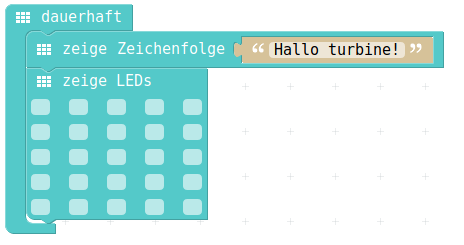

# Zeichenketten anzeigen

## Auswahl aus Menu


## PXT-Code



## JavaScript-Code

<details>
 <summary>Java-Script-Code</summary>

```js
basic.forever(() => {
    basic.showString("Hallo turbine!")
    basic.showLeds(`
        . . . . .
        . . . . .
        . . . . .
        . . . . .
        . . . . .
        `)
})
```
</details>

## Download Hex-Code


